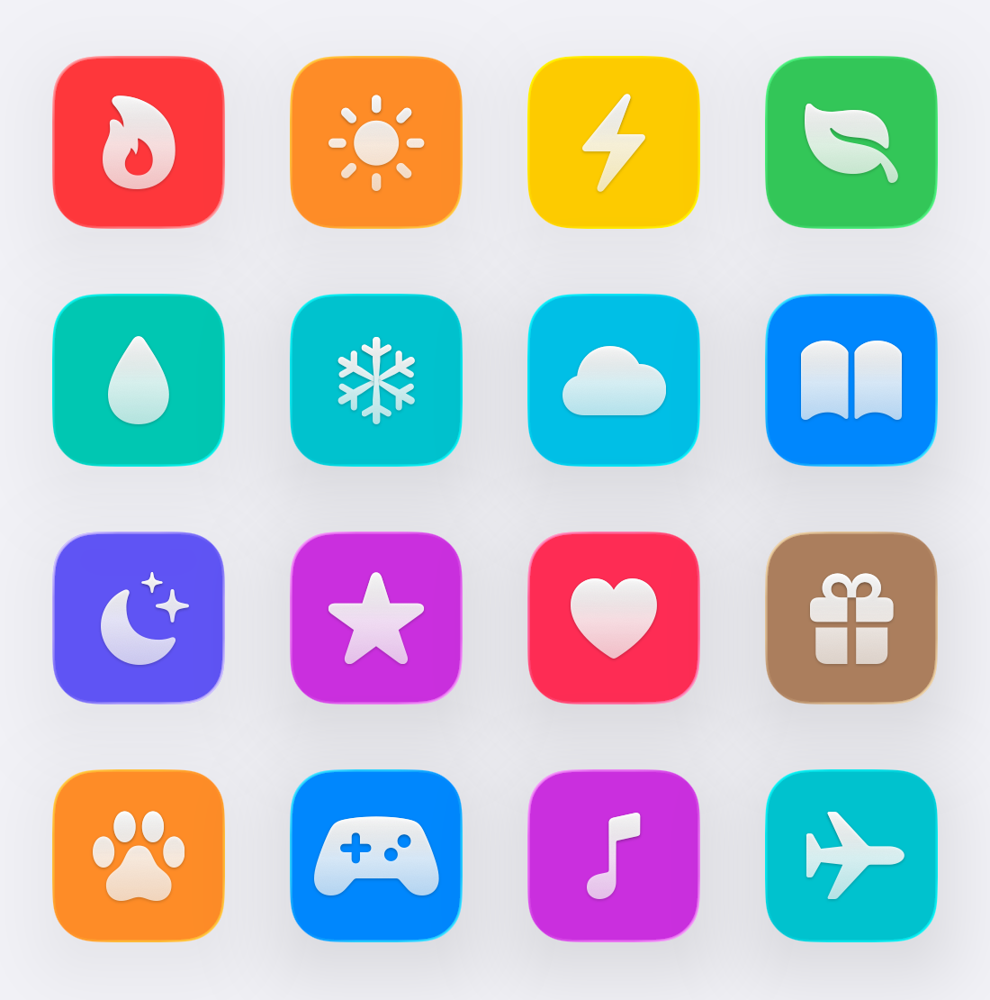
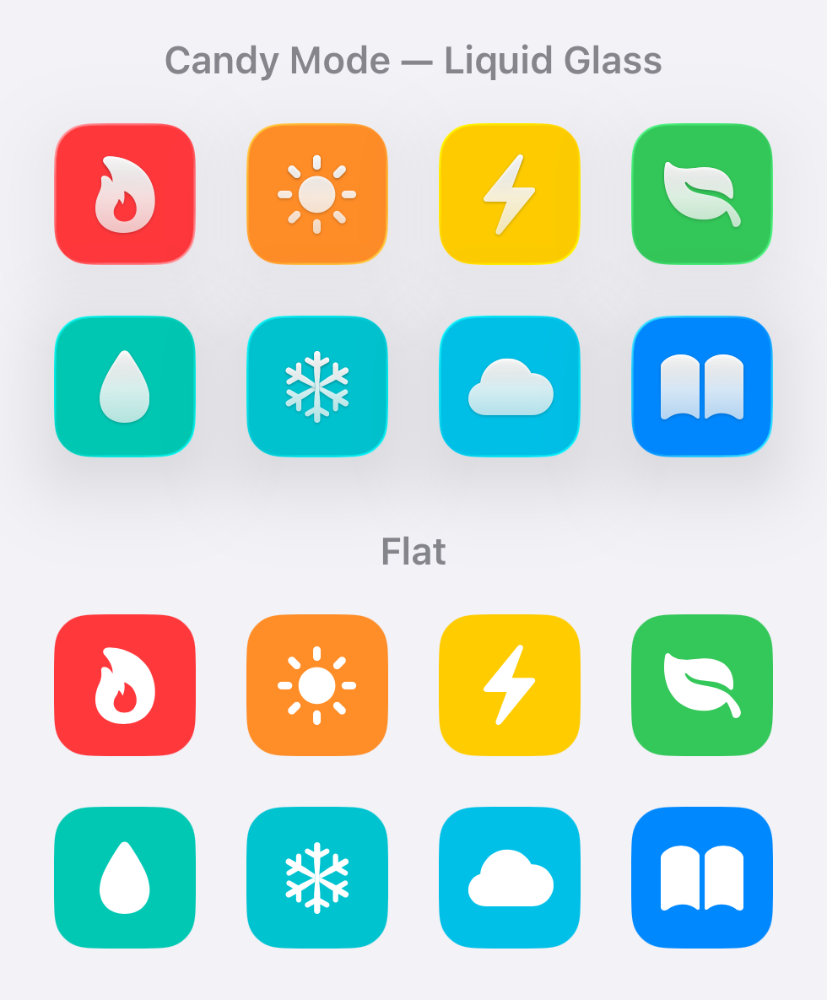
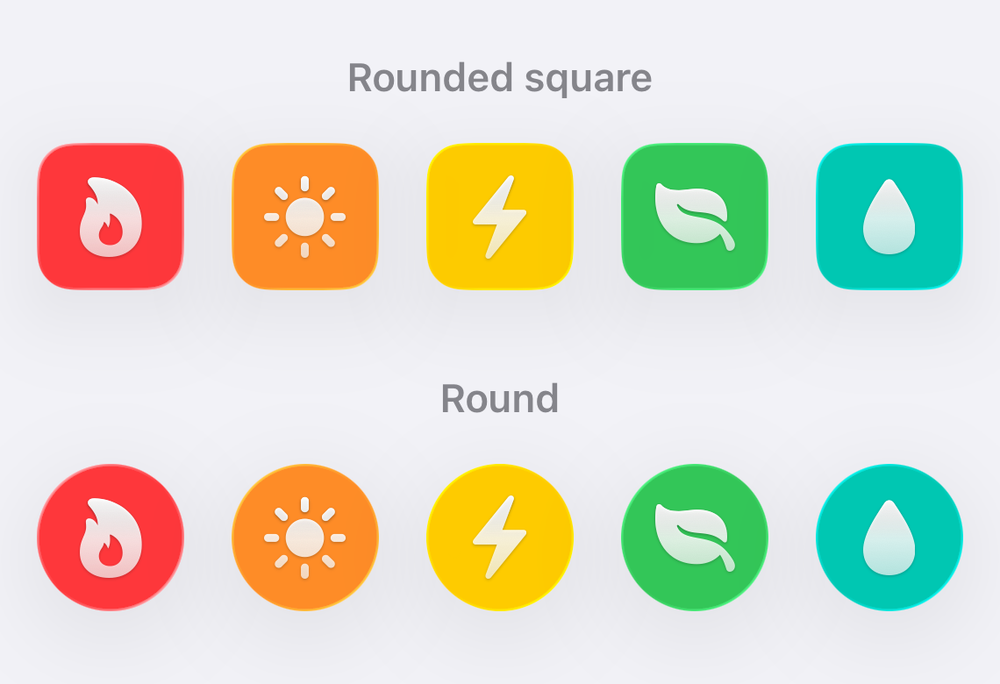
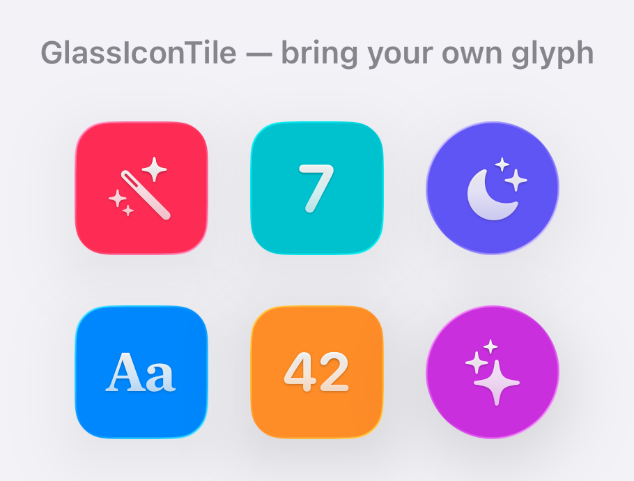
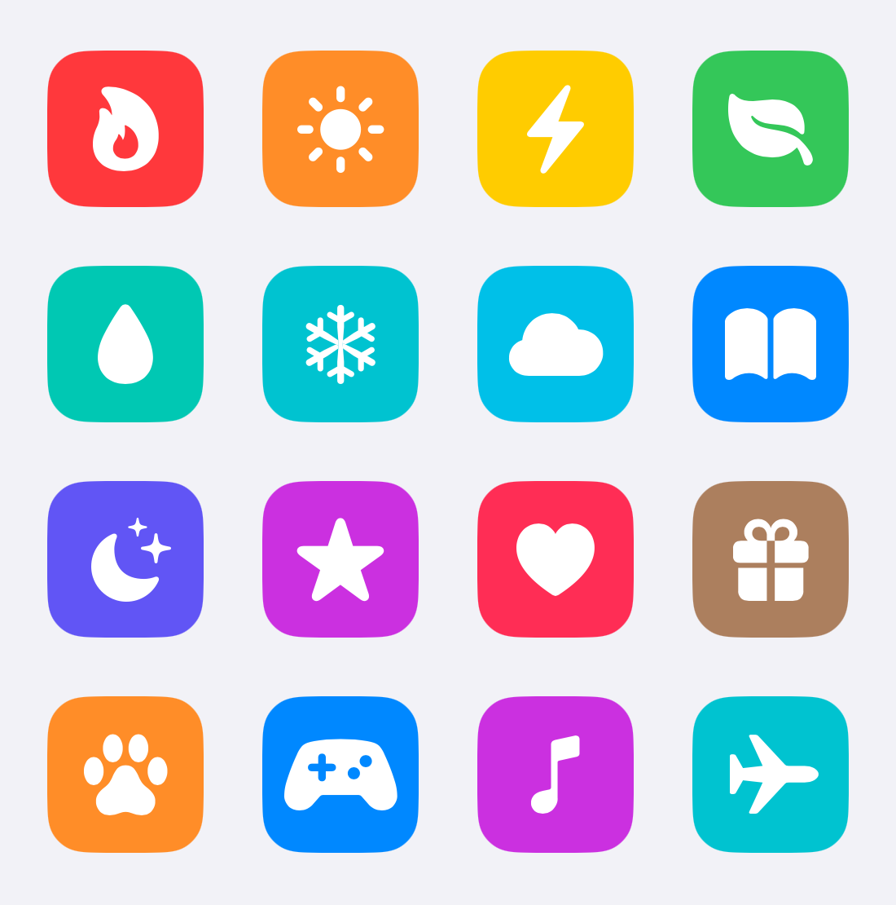

# GlassIconKit

**Tinted, glossy icon tiles for SwiftUI — restyled app-wide by a single user preference.**

   

<picture>
  <source media="(prefers-color-scheme: dark)" srcset="Assets/candy-grid-dark.png">
  
</picture>

## What is it?

A tiny, zero-dependency SwiftUI package that renders SF Symbols (or any view) on
tinted tiles with an optional glossy **Liquid Glass** finish. Four public pieces:

| Symbol | Kind | Purpose |
|---|---|---|
| `GlassIcon` | `View` | A symbol on a tinted tile. The common case — one line of code. |
| `GlassIconTile` | `View` | Generic tile with a custom glyph (any view), full control of size, shape, and base color. |
| `CandyGlyph` / `.candyGlyph(_:base:)` | `ViewModifier` | Just the glossy finish — sheen gradient, specular highlight, soft shadow — for an arbitrary glyph. |
| `IconStyle`, `VisualEffectStyle` | `enum` | The shared `@AppStorage` keys and defaults that drive the styling. |

## Why does it exist?

Apps that use colored icon tiles (think Settings rows, habit trackers, file
tags) usually hand-roll them per screen — and then a design change means
touching every one. GlassIconKit inverts that: every tile reads its style from
**shared user preferences**, so flipping one toggle restyles the entire app,
live:

- **Candy Mode** — tiles become tinted Liquid Glass and glyphs get a glossy,
  candy-like finish. Off, everything is a flat tinted fill.
- **Round Icons** — circles instead of rounded squares, everywhere at once.



There's a second, subtler reason: **glyph sizing**. SF Symbols are optically
balanced like a font, not like an image. GlassIconKit sizes glyphs with
`.font(...)` at a fixed fraction of the tile — never `.resizable()` — so every
symbol sits at a consistent visual size, properly centered, whether it's a
top-heavy `heart.fill` or a dense `calendar`. That's the detail that makes a
wall of icons look calm.

## What does it look like?

| Round Icons preference | Custom glyphs via `GlassIconTile` |
|---|---|
|  |  |

Flat mode (Candy off) stays just as usable — solid or gradient fills:



## Who is it for?

Any SwiftUI app targeting iOS 26+ / watchOS 26+ that shows icons on colored
tiles and wants them consistent: settings screens, trackers and habit apps,
tag/label editors, icon pickers, widgets, and watch apps. It was extracted from
[Numerate](https://apps.apple.com/app/numerate), where it styles every icon in
the app, the widgets, and the watch app from one pair of toggles.

## When should you use it (and when not)?

**Use it when** you have more than a couple of tinted icon tiles and want one
source of truth for their look — especially if you want to offer users a
"fancy vs. flat" visual preference without shipping two designs.

**Skip it if** you support anything below iOS 26 (the glass finish is built on
`glassEffect`, which has no earlier equivalent) or your icons are full-bleed
images rather than glyphs on tiles.

## How do I use it?

### Install

In Xcode: **File → Add Package Dependencies…** and paste the repo URL, or in
`Package.swift`:

```swift
.package(url: "https://github.com/bsurrey/GlassIconKit.git", from: "1.0.0")
```

### Show an icon

```swift
import GlassIconKit

// Simplest — symbol + tint, white glyph, default 29pt:
GlassIcon("flame.fill", tint: .orange)

// Larger, in a list row:
GlassIcon("drop.fill", tint: .blue, size: 44)

// Override the glyph color (defaults to white):
GlassIcon("bell.fill", tint: .yellow, glyphBase: .black)

// Shaded gradient fill (applies to the flat, non-Candy tile):
GlassIcon("star.fill", tint: .purple, gradient: true)
```

`glyphScale` (default `0.5`) sets the glyph's point size as a fraction of the
tile, so margins stay consistent across sizes. `cornerRadius` defaults to a
quarter of the tile size for both `GlassIcon` and `GlassIconTile`. Sizes are
clamped to zero — no runtime warnings on degenerate layout math — and an empty
symbol name renders a bare tile.

### Custom glyphs

For a non-symbol glyph (text, layered content), use the tile directly:

```swift
GlassIconTile(tint: .teal, size: 56) {
    Text("7").font(.system(size: 26, weight: .bold, design: .rounded))
}
```

Or apply just the glossy finish to any view:

```swift
Image(systemName: "star.fill")
    .font(.system(size: 28, weight: .semibold))
    .candyGlyph(isCandyOn, base: .white)
```

### Wire up the preference toggles

The components read shared `UserDefaults` keys via `@AppStorage`; bind your
settings UI to the same keys and every tile updates live:

```swift
@AppStorage(IconStyle.candyModeKey)  private var candyMode  = IconStyle.candyModeDefault
@AppStorage(IconStyle.roundIconsKey) private var roundIcons = IconStyle.roundIconsDefault

Toggle("Candy Mode", isOn: $candyMode)
Toggle("Round Icons", isOn: $roundIcons)
```

`VisualEffectStyle` adds two more keys — `shadowsEnabledKey` and
`gradientsEnabledKey` — that globally tone down the decorative parts of the
finish (useful for a "reduce visual effects" setting).

> **Note:** the keys are plain strings in `UserDefaults.standard`
> (`"candyMode"`, `"iconShapeRound"`, `"shadowsEnabled"`, `"gradientsEnabled"`).
> If your app already uses one of those names, they'll collide. To share the
> toggles with an app extension (e.g. a widget) via an App Group, render the
> views under `.defaultAppStorage(UserDefaults(suiteName: "group.your.id")!)`.

## Where do the details live?

- **Accessibility:** tiles are decorative and `accessibilityHidden` by default —
  they nearly always sit beside text that carries the meaning. To announce one,
  make its container an accessibility element and label it (the pattern is shown
  in the `GlassIconTile` documentation).
- **Dark glyphs:** the candy finish is tuned for light glyphs; for dark base
  colors it automatically softens the sheen and highlight (Rec. 601 luma on
  clamped sRGB components) so dark glyphs keep their gloss instead of washing
  out to gray.
- **Previews:** every component ships with `#Preview` galleries — including an
  alignment-grid overlay for judging glyph placement — using in-memory
  `defaultAppStorage` suites so specific Candy/Round combinations render side
  by side without touching real preferences.
- **Swift 6:** the package builds in the Swift 6 language mode (strict
  concurrency) with zero warnings, tools 6.2.

## Requirements

- iOS 26+ / watchOS 26+ (uses `glassEffect`)
- Swift tools 6.2+, Swift 6 language mode
- No dependencies

## License

MIT — see [LICENSE](LICENSE).
